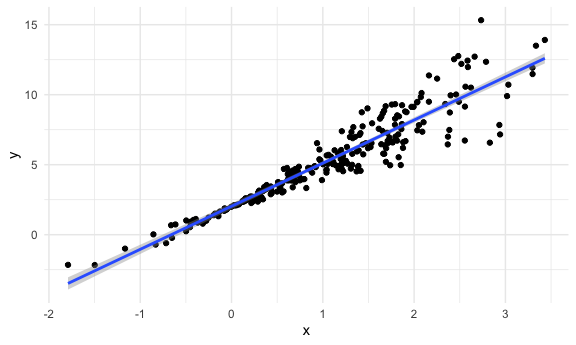

bootstrap
================
Yuying Lu
2024-11-07

``` r
library(tidyverse)
library(p8105.datasets)

knitr::opts_chunk$set(
  fig.width = 6,
  fig.asp = .6,
  out.width = "90%"
)

theme_set(theme_minimal() + theme(legend.position = "bottom"))

options(
  ggplot2.continuous.colour = "viridis",
  ggplot2.continuous.fill = "viridis"
)

scale_colour_discrete = scale_colour_viridis_d
scale_fill_discrete = scale_fill_viridis_d
```

do some bootstrapping!!

make up some data

``` r
n_samp = 250

sim_df_constant = 
  tibble(
    x = rnorm(n_samp, 1, 1),
    error = rnorm(n_samp, 0, 1),
    y = 2 + 3 * x + error
  )

sim_df_nonconstant = 
  sim_df_constant |> 
  mutate(
    error = error * .75 * x,
    y = 2 + 3 * x + error
  )
```

Let’s look at these.

``` r
sim_df_nonconstant |> 
  ggplot(aes(x = x, y = y)) +
  geom_point() + 
  stat_smooth(method = "lm")
```



``` r
sim_df_constant |> 
 lm( y ~ x, data = _) |> 
  broom::tidy() |> 
  knitr::kable(digits = 3)
```

| term        | estimate | std.error | statistic | p.value |
|:------------|---------:|----------:|----------:|--------:|
| (Intercept) |    1.959 |     0.086 |    22.722 |       0 |
| x           |    2.965 |     0.064 |    46.304 |       0 |

``` r
sim_df_nonconstant |> 
 lm( y ~ x, data = _) |> 
  broom::tidy() |> 
  knitr::kable(digits = 3)
```

| term        | estimate | std.error | statistic | p.value |
|:------------|---------:|----------:|----------:|--------:|
| (Intercept) |    2.081 |     0.082 |    25.319 |       0 |
| x           |    2.830 |     0.061 |    46.359 |       0 |

Never trust p-value is the bottom line here

## Draw a bootstrap sample

``` r
boot_sample = function(df){
  boot_df = 
    sample_frac(df, replace = TRUE)
  return(boot_df)
}
```

Let’s try running this!

``` r
sim_df_nonconstant |> 
  boot_sample()|> 
  ggplot(aes(x = x, y = y)) +
  geom_point(alpha = .5) + 
  stat_smooth(method = "lm")
```


can we do this as part of an analysis?

``` r
sim_df_nonconstant |> 
  boot_sample() |> 
  lm(y ~ x, data = _) |> 
  broom::tidy() |> 
  knitr::kable(digits = 3)
```

| term        | estimate | std.error | statistic | p.value |
|:------------|---------:|----------:|----------:|--------:|
| (Intercept) |    2.124 |     0.084 |    25.220 |       0 |
| x           |    2.820 |     0.060 |    46.755 |       0 |

## bootstrap A LOT

``` r
boot_straps = 
  tibble(
    strap_number = 1:10
  ) |> 
  mutate(
    strap_sample = map(strap_number, \(i) boot_sample(df = sim_df_nonconstant)),
    models = map(strap_sample, \(df) lm(y ~ x, data = df)),
    results = map(models, broom::tidy)
  )

boot_straps |> unnest(strap_sample)
```

    ## # A tibble: 2,500 × 6
    ##    strap_number     x   error     y models results         
    ##           <int> <dbl>   <dbl> <dbl> <list> <list>          
    ##  1            1 2.00   0.821   8.81 <lm>   <tibble [2 × 5]>
    ##  2            1 2.00   0.821   8.81 <lm>   <tibble [2 × 5]>
    ##  3            1 0.527 -0.0731  3.51 <lm>   <tibble [2 × 5]>
    ##  4            1 0.809  0.607   5.03 <lm>   <tibble [2 × 5]>
    ##  5            1 1.90  -0.610   7.09 <lm>   <tibble [2 × 5]>
    ##  6            1 1.27  -0.469   5.34 <lm>   <tibble [2 × 5]>
    ##  7            1 0.479  0.0735  3.51 <lm>   <tibble [2 × 5]>
    ##  8            1 1.13   0.467   5.85 <lm>   <tibble [2 × 5]>
    ##  9            1 1.31  -0.972   4.95 <lm>   <tibble [2 × 5]>
    ## 10            1 1.50   0.531   7.04 <lm>   <tibble [2 × 5]>
    ## # ℹ 2,490 more rows

``` r
boot_strap_results = 
  boot_straps |> 
  select(strap_number, results) |> 
  unnest(results) |> 
  group_by(term) |> 
  summarise(boot_se = sd(estimate)) |> 
  knitr::kable(digits = 3)

boot_strap_results
```

| term        | boot_se |
|:------------|--------:|
| (Intercept) |   0.050 |
| x           |   0.067 |

compare ti with our initial result:

``` r
sim_df_nonconstant |> 
 lm( y ~ x, data = _) |> 
  broom::tidy() |> 
  knitr::kable(digits = 3)
```

| term        | estimate | std.error | statistic | p.value |
|:------------|---------:|----------:|----------:|--------:|
| (Intercept) |    2.081 |     0.082 |    25.319 |       0 |
| x           |    2.830 |     0.061 |    46.359 |       0 |

``` r
boot_straps = 
  tibble(
    strap_number = 1:10
  ) |> 
  mutate(
    strap_sample = map(strap_number, \(i) boot_sample(df = sim_df_constant)),
    models = map(strap_sample, \(df) lm(y ~ x, data = df)),
    results = map(models, broom::tidy)
  )

boot_strap_results = 
  boot_straps |> 
  select(strap_number, results) |> 
  unnest(results) |> 
  group_by(term) |> 
  summarise(boot_se = sd(estimate)) |> 
  knitr::kable(digits = 3)

sim_df_constant |> 
 lm( y ~ x, data = _) |> 
  broom::tidy() |> 
  knitr::kable(digits = 3)
```

| term        | estimate | std.error | statistic | p.value |
|:------------|---------:|----------:|----------:|--------:|
| (Intercept) |    1.959 |     0.086 |    22.722 |       0 |
| x           |    2.965 |     0.064 |    46.304 |       0 |

## do this all using modelr

``` r
boot_straps = 
  sim_df_nonconstant |> 
  modelr::bootstrap(1000) |> 
  mutate(
    strap = map(strap, as.tibble),
    models = map(strap, \(df) lm(y ~ x, data = df)),
    results = map(models, broom::tidy)
  ) |> 
  select(.id, results) |> 
  unnest(results)
```

## what do you want to repeat

``` r
boot_straps |> 
  group_by(term) |> 
  summarise(
    boot_est = mean(estimate),
    boot_se = sd(estimate),
    boot_ci_ll = quantile(estimate, .025),
    boot_ci_ul = quantile(estimate, .975),
  )
```

    ## # A tibble: 2 × 5
    ##   term        boot_est boot_se boot_ci_ll boot_ci_ul
    ##   <chr>          <dbl>   <dbl>      <dbl>      <dbl>
    ## 1 (Intercept)     2.08  0.0477       1.98       2.17
    ## 2 x               2.83  0.0782       2.68       2.99

## Air BNB

``` r
data("nyc_aribnb")

manhattan_df = 
  nyc_airbnb |>
  mutate(stars = review_scores_location / 2) |> 
  rename(borough = neighbourhood_group, 
         neighbourhood = neighbourhood) |> 
  filter(borough == "Manhattan")

manhattan_df |> 
  ggplot(aes(x = stars, price)) +
  geom_point() +
  stat_smooth(method = "lm", se = FALSE)
```


``` r
manhattan_df |> 
  lm(price ~ stars + room_type, data = _) |> 
  broom::tidy()
```

    ## # A tibble: 4 × 5
    ##   term                  estimate std.error statistic   p.value
    ##   <chr>                    <dbl>     <dbl>     <dbl>     <dbl>
    ## 1 (Intercept)               95.7     22.2       4.31 1.62e-  5
    ## 2 stars                     27.1      4.59      5.91 3.45e-  9
    ## 3 room_typePrivate room   -124.       3.46    -35.8  9.40e-270
    ## 4 room_typeShared room    -154.      10.1     -15.3  2.47e- 52

bootstrap for better inferece

``` r
manhattan_df |> 
  modelr::bootstrap(1000) |> 
  mutate(
    strap = map(strap, as.tibble),
    models = map(strap, \(df) lm(price ~ stars + room_type, data = df)),
    results = map(models, broom::tidy)
  ) |> 
  select(.id, results) |> 
  unnest(results) |> 
  filter(term == "stars") |> 
  ggplot(aes(estimate)) +
  geom_density()
```


``` r
boot_straps |> 
  group_by(term) |> 
  summarise(
    boot_est = mean(estimate),
    boot_se = sd(estimate),
    boot_ci_ll = quantile(estimate, .025),
    boot_ci_ul = quantile(estimate, .975),
  )
```

    ## # A tibble: 2 × 5
    ##   term        boot_est boot_se boot_ci_ll boot_ci_ul
    ##   <chr>          <dbl>   <dbl>      <dbl>      <dbl>
    ## 1 (Intercept)     2.08  0.0477       1.98       2.17
    ## 2 x               2.83  0.0782       2.68       2.99
