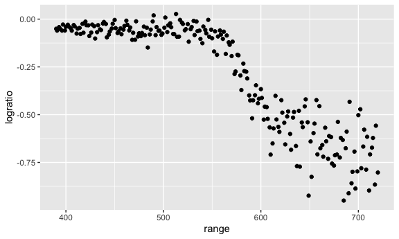
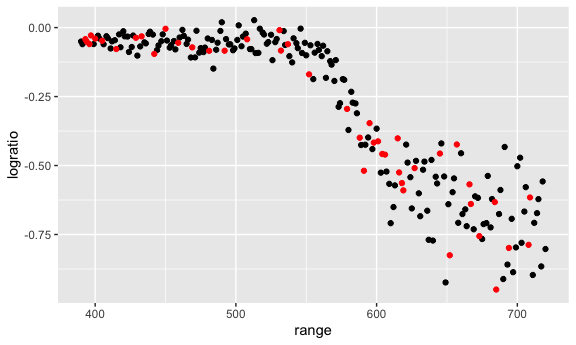
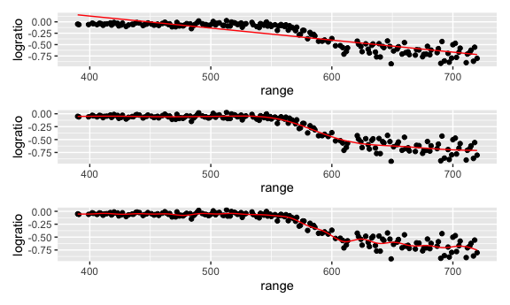
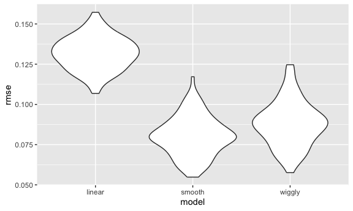
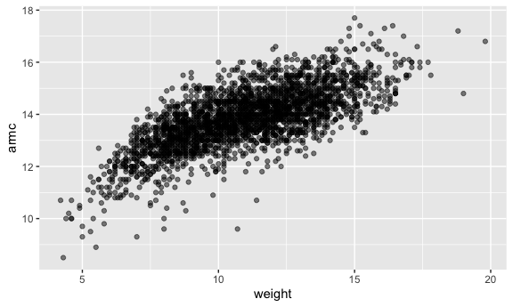
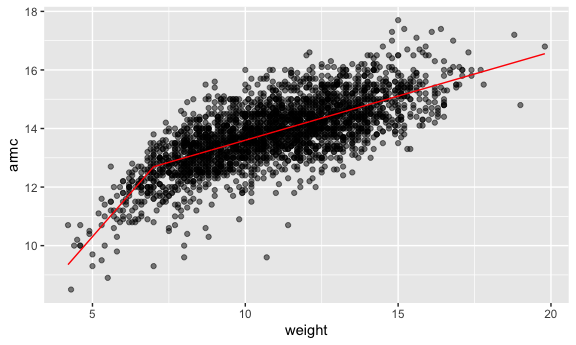
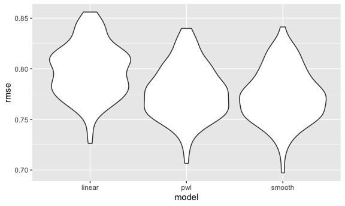

linear model
================
Yuying Lu
2024-11-07

``` r
library(tidyverse)
```

    ## ── Attaching core tidyverse packages ──────────────────────── tidyverse 2.0.0 ──
    ## ✔ dplyr     1.1.4     ✔ readr     2.1.5
    ## ✔ forcats   1.0.0     ✔ stringr   1.5.1
    ## ✔ ggplot2   3.5.1     ✔ tibble    3.2.1
    ## ✔ lubridate 1.9.3     ✔ tidyr     1.3.1
    ## ✔ purrr     1.0.2     
    ## ── Conflicts ────────────────────────────────────────── tidyverse_conflicts() ──
    ## ✖ dplyr::filter() masks stats::filter()
    ## ✖ dplyr::lag()    masks stats::lag()
    ## ℹ Use the conflicted package (<http://conflicted.r-lib.org/>) to force all conflicts to become errors

``` r
knitr::opts_chunk$set(
  fig.width = 6,
  fig.asp = .6,
  out.width = "90%"
)

theme_set(theme(legend.position = "bottom"))

options(
  ggplot2.continuous.colour = "viridis",
  ggplot2.continuous.fill = "viridis"
)

scale_colour_discrete = scale_colour_viridis_d
scale_fill_discrete = scale_fill_viridis_d
```

``` r
library(tidyverse)
library(modelr)
library(mgcv)
```

    ## Loading required package: nlme

    ## 
    ## Attaching package: 'nlme'

    ## The following object is masked from 'package:dplyr':
    ## 
    ##     collapse

    ## This is mgcv 1.9-1. For overview type 'help("mgcv-package")'.

``` r
library(SemiPar)
# install.packages("SemiPar")
set.seed(1)
```

``` r
data("lidar")
lidar_df = 
  lidar |> 
  as_tibble() |> 
  mutate(id = row_number())
```

``` r
lidar_df |> 
  ggplot(aes(x = range, y = logratio)) +
  geom_point()
```



## Try to do CV

We’ll compare 3 models – one linear, one smooth, one wiggly

Construct training and testing df

``` r
train_df = sample_frac(lidar_df, size = .8)
test_df = anti_join(lidar_df, train_df, by = 'id')
```

``` r
ggplot(train_df, aes(x = range, y = logratio)) +
  geom_point() +
  geom_point(data = test_df, color = 'red')
```



Fit three models

``` r
linear_mod = lm(logratio ~ range, data = train_df)
smooth_mod = gam(logratio ~ s(range), data = train_df)
wiggly_mod = gam(logratio ~ s(range, k=30), sp = 10e-6, data = train_df)
```

Look at fits

``` r
library(patchwork)
plot1 = 
  train_df |> 
  add_predictions(linear_mod) |> 
  ggplot(aes(x = range, y = logratio)) + 
  geom_point() +
  geom_line(aes(y = pred), color = 'red')

plot2 = 
  train_df |> 
  add_predictions(smooth_mod) |> 
  ggplot(aes(x = range, y = logratio)) + 
  geom_point() +
  geom_line(aes(y = pred), color = 'red')

plot3 = 
  train_df |> 
  add_predictions(wiggly_mod) |> 
  ggplot(aes(x = range, y = logratio)) + 
  geom_point() +
  geom_line(aes(y = pred), color = 'red')

plot1 + plot2 + plot3 + plot_layout(ncol = 1)
```



Compare these numerically using RMSE

``` r
rmse(linear_mod, test_df)
```

    ## [1] 0.127317

``` r
rmse(smooth_mod, test_df)
```

    ## [1] 0.08302008

``` r
rmse(wiggly_mod, test_df)
```

    ## [1] 0.08848557

## Repeat the train / test split

``` r
cv_df = 
  crossv_mc(lidar_df, 100)
```

``` r
cv_df |> 
  pull(train) |> 
  nth(2) |> 
  as.tibble()
```

    ## Warning: `as.tibble()` was deprecated in tibble 2.0.0.
    ## ℹ Please use `as_tibble()` instead.
    ## ℹ The signature and semantics have changed, see `?as_tibble`.
    ## This warning is displayed once every 8 hours.
    ## Call `lifecycle::last_lifecycle_warnings()` to see where this warning was
    ## generated.

    ## # A tibble: 176 × 3
    ##    range logratio    id
    ##    <int>    <dbl> <int>
    ##  1   390  -0.0504     1
    ##  2   393  -0.0419     3
    ##  3   394  -0.0510     4
    ##  4   396  -0.0599     5
    ##  5   397  -0.0284     6
    ##  6   399  -0.0596     7
    ##  7   400  -0.0399     8
    ##  8   402  -0.0294     9
    ##  9   403  -0.0395    10
    ## 10   405  -0.0476    11
    ## # ℹ 166 more rows

``` r
cv_df = cv_df |>
  mutate(train = map(train, as.tibble),
         test = map(test, as.tibble))


cv_res_df = 
  cv_df |> 
  mutate(
    linear_mod = map(train, \(x) lm(logratio ~ range, data = x)),
    smooth_mod = map(train, \(x) gam(logratio ~ s(range), data = x)),
    wiggly_mod = map(train, \(x) gam(logratio ~ s(range, k=30), sp = 10e-6, data = x))
  ) |> 
  mutate(
    rmse_linear = map2_dbl(linear_mod, test, rmse),
    rmse_smooth = map2_dbl(smooth_mod, test, rmse),
    rmse_wiggly = map2_dbl(wiggly_mod, test, rmse)
  )
```

Look at RMSE distribution

``` r
cv_res_df |> 
  select(starts_with("rmse")) |> 
  pivot_longer(
    everything(),
    names_to = "model",
    values_to = "rmse",
    names_prefix = "rmse_"
  ) |> 
  ggplot(aes(x = model, y = rmse)) +
  geom_violin()
```



``` r
child_df = 
  read_csv("data/nepalese_children.csv") |> 
  mutate(
    weight_ch7 = (weight > 7) * (weight - 7)
  )
```

    ## Rows: 2705 Columns: 5
    ## ── Column specification ────────────────────────────────────────────────────────
    ## Delimiter: ","
    ## dbl (5): age, sex, weight, height, armc
    ## 
    ## ℹ Use `spec()` to retrieve the full column specification for this data.
    ## ℹ Specify the column types or set `show_col_types = FALSE` to quiet this message.

Look at data

``` r
child_df |> 
  ggplot(aes(x = weight, y = armc)) +
  geom_point(alpha = .5)
```



Fit some models

``` r
linear_mod = lm(armc ~ weight, data = child_df)
pwl_mod = lm(armc ~ weight + weight_ch7, data = child_df)
smooth_mod = gam(armc ~ s(weight), data = child_df)
```

Look at the models

``` r
child_df |> 
  add_predictions(pwl_mod) |> 
  ggplot(aes(x = weight, y = armc)) +
  geom_point(alpha = .5) +
  geom_line(aes(y = pred), color = 'red')
```



CV to select models.

``` r
cv_df = 
  crossv_mc(child_df, 100) |> 
  mutate(
    train = map(train, as.tibble),
    test = map(test, as.tibble))
```

``` r
cv_res_df = 
  cv_df |> 
  mutate(
    linear_mod = map(train, \(x) lm(armc ~ weight, data = x)),
    pwl_mod = map(train, \(x) lm(armc ~ weight + weight_ch7, data = x)),
    smooth_mod = map(train, \(x) gam(armc ~ s(weight), data = x))
  ) |> 
  mutate(
    rmse_linear = map2_dbl(linear_mod, test, rmse),
    rmse_pwl = map2_dbl(pwl_mod, test, rmse),
    rmse_smooth = map2_dbl(smooth_mod, test, rmse),
  )
```

``` r
cv_res_df |> 
  select(starts_with("rmse")) |> 
  pivot_longer(
    everything(),
    names_to = "model",
    values_to = "rmse",
    names_prefix = "rmse_"
  ) |> 
  ggplot(aes(x = model, y = rmse)) +
  geom_violin()
```


