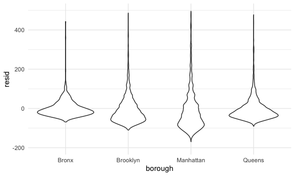
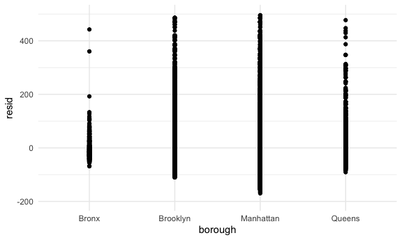
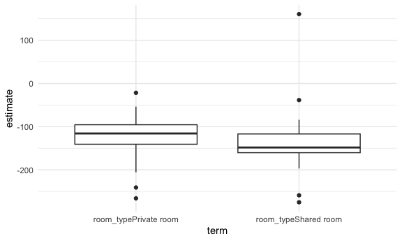

linear model
================
Yuying Lu
2024-11-07

``` r
library(tidyverse)
```

    ## ── Attaching core tidyverse packages ──────────────────────── tidyverse 2.0.0 ──
    ## ✔ dplyr     1.1.4     ✔ readr     2.1.5
    ## ✔ forcats   1.0.0     ✔ stringr   1.5.1
    ## ✔ ggplot2   3.5.1     ✔ tibble    3.2.1
    ## ✔ lubridate 1.9.3     ✔ tidyr     1.3.1
    ## ✔ purrr     1.0.2     
    ## ── Conflicts ────────────────────────────────────────── tidyverse_conflicts() ──
    ## ✖ dplyr::filter() masks stats::filter()
    ## ✖ dplyr::lag()    masks stats::lag()
    ## ℹ Use the conflicted package (<http://conflicted.r-lib.org/>) to force all conflicts to become errors

``` r
knitr::opts_chunk$set(
  fig.width = 6,
  fig.asp = .6,
  out.width = "90%"
)

theme_set(theme_minimal() + theme(legend.position = "bottom"))

options(
  ggplot2.continuous.colour = "viridis",
  ggplot2.continuous.fill = "viridis"
)

scale_colour_discrete = scale_colour_viridis_d
scale_fill_discrete = scale_fill_viridis_d
```

``` r
library(tidyverse)
library(p8105.datasets)

set.seed(1)
```

``` r
data("nyc_airbnb")

nyc_airbnb = 
  nyc_airbnb |> 
  mutate(stars = review_scores_location / 2) |> 
  rename(
    borough = neighbourhood_group,
    neighborhood = neighbourhood) |> 
  filter(borough != "Staten Island") |> 
  select(price, stars, borough, neighborhood, room_type)

# new mutate() at about 10:25 go back to see

nyc_airbnb
```

    ## # A tibble: 40,492 × 5
    ##    price stars borough neighborhood room_type      
    ##    <dbl> <dbl> <chr>   <chr>        <chr>          
    ##  1    99   5   Bronx   City Island  Private room   
    ##  2   200  NA   Bronx   City Island  Private room   
    ##  3   300  NA   Bronx   City Island  Entire home/apt
    ##  4   125   5   Bronx   City Island  Entire home/apt
    ##  5    69   5   Bronx   City Island  Private room   
    ##  6   125   5   Bronx   City Island  Entire home/apt
    ##  7    85   5   Bronx   City Island  Entire home/apt
    ##  8    39   4.5 Bronx   Allerton     Private room   
    ##  9    95   5   Bronx   Allerton     Entire home/apt
    ## 10   125   4.5 Bronx   Allerton     Entire home/apt
    ## # ℹ 40,482 more rows

## Fit some models

Start relatively simple.

``` r
fit = lm(price ~ stars, data = nyc_airbnb)
fit
```

    ## 
    ## Call:
    ## lm(formula = price ~ stars, data = nyc_airbnb)
    ## 
    ## Coefficients:
    ## (Intercept)        stars  
    ##      -66.50        44.11

``` r
names(fit)
```

    ##  [1] "coefficients"  "residuals"     "effects"       "rank"         
    ##  [5] "fitted.values" "assign"        "qr"            "df.residual"  
    ##  [9] "na.action"     "xlevels"       "call"          "terms"        
    ## [13] "model"

``` r
summary(fit)
```

    ## 
    ## Call:
    ## lm(formula = price ~ stars, data = nyc_airbnb)
    ## 
    ## Residuals:
    ##    Min     1Q Median     3Q    Max 
    ## -144.1  -69.1  -32.0   25.9 9889.0 
    ## 
    ## Coefficients:
    ##             Estimate Std. Error t value Pr(>|t|)    
    ## (Intercept)  -66.500     11.893  -5.591 2.27e-08 ***
    ## stars         44.115      2.515  17.538  < 2e-16 ***
    ## ---
    ## Signif. codes:  0 '***' 0.001 '**' 0.01 '*' 0.05 '.' 0.1 ' ' 1
    ## 
    ## Residual standard error: 183.8 on 30528 degrees of freedom
    ##   (9962 observations deleted due to missingness)
    ## Multiple R-squared:  0.009974,   Adjusted R-squared:  0.009942 
    ## F-statistic: 307.6 on 1 and 30528 DF,  p-value: < 2.2e-16

``` r
names(summary(fit))
```

    ##  [1] "call"          "terms"         "residuals"     "coefficients" 
    ##  [5] "aliased"       "sigma"         "df"            "r.squared"    
    ##  [9] "adj.r.squared" "fstatistic"    "cov.unscaled"  "na.action"

``` r
coef(fit)
```

    ## (Intercept)       stars 
    ##   -66.50023    44.11475

``` r
fit |> 
  broom::tidy() |> 
  select(term, estimate, p.value)
```

    ## # A tibble: 2 × 3
    ##   term        estimate  p.value
    ##   <chr>          <dbl>    <dbl>
    ## 1 (Intercept)    -66.5 2.27e- 8
    ## 2 stars           44.1 1.61e-68

``` r
fit |> 
  broom::glance()
```

    ## # A tibble: 1 × 12
    ##   r.squared adj.r.squared sigma statistic  p.value    df   logLik     AIC    BIC
    ##       <dbl>         <dbl> <dbl>     <dbl>    <dbl> <dbl>    <dbl>   <dbl>  <dbl>
    ## 1   0.00997       0.00994  184.      308. 1.61e-68     1 -202491. 404989. 4.05e5
    ## # ℹ 3 more variables: deviance <dbl>, df.residual <int>, nobs <int>

Try a bit more complex.

``` r
fit = lm(price ~ stars + borough, data = nyc_airbnb)

fit |> 
  broom::tidy() |> 
  select(term, estimate, p.value) |> 
  mutate(
    term = str_replace(term, "borough", "Borough: ")
  ) |> 
  knitr::kable(digits = 3)
```

| term               | estimate | p.value |
|:-------------------|---------:|--------:|
| (Intercept)        |  -70.414 |   0.000 |
| stars              |   31.990 |   0.000 |
| Borough: Brooklyn  |   40.500 |   0.000 |
| Borough: Manhattan |   90.254 |   0.000 |
| Borough: Queens    |   13.206 |   0.145 |

## Some diagnostics

(backtrack to some EDA)

Most diago

``` r
modelr::add_residuals(nyc_airbnb, fit) |> 
  ggplot(aes(x = borough, y = resid))+
  geom_violin() +
  ylim(-200,500)
```

    ## Warning: Removed 10202 rows containing non-finite outside the scale range
    ## (`stat_ydensity()`).



``` r
modelr::add_residuals(nyc_airbnb, fit) |> 
  ggplot(aes(x = borough, y = resid))+
  geom_point() +
  ylim(-200,500)
```

    ## Warning: Removed 10202 rows containing missing values or values outside the scale range
    ## (`geom_point()`).



Residuals against fitted values

``` r
nyc_airbnb |> 
  modelr::add_residuals(fit) |> 
  modelr::add_predictions(fit) |> 
  ggplot(aes(x = pred, y = resid))+
  geom_point()
```

    ## Warning: Removed 9962 rows containing missing values or values outside the scale range
    ## (`geom_point()`).


for single coefficient

``` r
fit = lm(price ~ stars + borough, data = nyc_airbnb)

fit |> 
  broom::tidy()
```

    ## # A tibble: 5 × 5
    ##   term             estimate std.error statistic  p.value
    ##   <chr>               <dbl>     <dbl>     <dbl>    <dbl>
    ## 1 (Intercept)         -70.4     14.0      -5.02 5.14e- 7
    ## 2 stars                32.0      2.53     12.7  1.27e-36
    ## 3 boroughBrooklyn      40.5      8.56      4.73 2.23e- 6
    ## 4 boroughManhattan     90.3      8.57     10.5  6.64e-26
    ## 5 boroughQueens        13.2      9.06      1.46 1.45e- 1

When adding more than one coefficient, use `anova`

``` r
fit_null = lm(price ~ stars + borough, data = nyc_airbnb)
fit_alt = lm(price ~ stars + borough + room_type, data = nyc_airbnb)


fit_null |> 
  broom::tidy()
```

    ## # A tibble: 5 × 5
    ##   term             estimate std.error statistic  p.value
    ##   <chr>               <dbl>     <dbl>     <dbl>    <dbl>
    ## 1 (Intercept)         -70.4     14.0      -5.02 5.14e- 7
    ## 2 stars                32.0      2.53     12.7  1.27e-36
    ## 3 boroughBrooklyn      40.5      8.56      4.73 2.23e- 6
    ## 4 boroughManhattan     90.3      8.57     10.5  6.64e-26
    ## 5 boroughQueens        13.2      9.06      1.46 1.45e- 1

``` r
fit_alt |> 
  broom::tidy()
```

    ## # A tibble: 7 × 5
    ##   term                  estimate std.error statistic  p.value
    ##   <chr>                    <dbl>     <dbl>     <dbl>    <dbl>
    ## 1 (Intercept)              49.5      13.6      3.64  2.76e- 4
    ## 2 stars                    21.9       2.43     9.01  2.09e-19
    ## 3 boroughBrooklyn          22.7       8.20     2.77  5.60e- 3
    ## 4 boroughManhattan         63.0       8.22     7.67  1.76e-14
    ## 5 boroughQueens             7.58      8.68     0.873 3.82e- 1
    ## 6 room_typePrivate room  -105.        2.05   -51.2   0       
    ## 7 room_typeShared room   -129.        6.15   -21.0   2.24e-97

``` r
anova(fit_null, fit_alt) |> 
  broom::tidy()
```

    ## # A tibble: 2 × 7
    ##   term                        df.residual    rss    df   sumsq statistic p.value
    ##   <chr>                             <dbl>  <dbl> <dbl>   <dbl>     <dbl>   <dbl>
    ## 1 price ~ stars + borough           30525 1.01e9    NA NA            NA       NA
    ## 2 price ~ stars + borough + …       30523 9.21e8     2  8.42e7     1394.       0

## Do effects differ across boroughs

First, use a lot of interactions

``` r
nyc_airbnb |> 
  lm(price ~ stars * borough + room_type * borough, data = _) |> 
  broom::tidy()
```

    ## # A tibble: 16 × 5
    ##    term                                   estimate std.error statistic   p.value
    ##    <chr>                                     <dbl>     <dbl>     <dbl>     <dbl>
    ##  1 (Intercept)                               90.1       75.4    1.19   0.232    
    ##  2 stars                                      4.45      16.6    0.267  0.789    
    ##  3 boroughBrooklyn                          -20.4       77.1   -0.265  0.791    
    ##  4 boroughManhattan                           5.63      77.8    0.0723 0.942    
    ##  5 boroughQueens                              1.51      83.5    0.0181 0.986    
    ##  6 room_typePrivate room                    -52.9       17.8   -2.98   0.00288  
    ##  7 room_typeShared room                     -70.5       41.6   -1.70   0.0896   
    ##  8 stars:boroughBrooklyn                     16.5       17.0    0.973  0.331    
    ##  9 stars:boroughManhattan                    22.7       17.1    1.33   0.185    
    ## 10 stars:boroughQueens                        5.21      18.3    0.285  0.776    
    ## 11 boroughBrooklyn:room_typePrivate room    -39.3       18.0   -2.18   0.0292   
    ## 12 boroughManhattan:room_typePrivate room   -71.3       18.0   -3.96   0.0000754
    ## 13 boroughQueens:room_typePrivate room      -16.3       19.0   -0.859  0.390    
    ## 14 boroughBrooklyn:room_typeShared room     -35.3       42.9   -0.822  0.411    
    ## 15 boroughManhattan:room_typeShared room    -83.1       42.5   -1.96   0.0503   
    ## 16 boroughQueens:room_typeShared room       -24.4       44.4   -0.550  0.582

Could just fit separate models

``` r
nyc_airbnb |> 
  filter(borough == "Manhattan") |> 
  lm(price ~ stars + room_type, data = _) |> 
  broom::tidy()
```

    ## # A tibble: 4 × 5
    ##   term                  estimate std.error statistic   p.value
    ##   <chr>                    <dbl>     <dbl>     <dbl>     <dbl>
    ## 1 (Intercept)               95.7     22.2       4.31 1.62e-  5
    ## 2 stars                     27.1      4.59      5.91 3.45e-  9
    ## 3 room_typePrivate room   -124.       3.46    -35.8  9.40e-270
    ## 4 room_typeShared room    -154.      10.1     -15.3  2.47e- 52

``` r
nyc_airbnb |> 
  filter(borough == "Brooklyn") |> 
  lm(price ~ stars + room_type, data = _) |> 
  broom::tidy()
```

    ## # A tibble: 4 × 5
    ##   term                  estimate std.error statistic   p.value
    ##   <chr>                    <dbl>     <dbl>     <dbl>     <dbl>
    ## 1 (Intercept)               69.6     14.0       4.96 7.27e-  7
    ## 2 stars                     21.0      2.98      7.05 1.90e- 12
    ## 3 room_typePrivate room    -92.2      2.72    -34.0  6.40e-242
    ## 4 room_typeShared room    -106.       9.43    -11.2  4.15e- 29

Get fancy and use list columns

``` r
nyc_airbnb |> 
  nest(data = -borough) |> 
  mutate(
    model = map(data, \(x) lm(price ~ stars + room_type, data = x)),
    results = map(model, broom::tidy)
  ) |> 
  select(borough, results) |> 
  unnest(results) |> 
  select(borough, term, estimate) |> 
  pivot_wider(
    names_from = term,
    values_from = estimate
  )
```

    ## # A tibble: 4 × 5
    ##   borough   `(Intercept)` stars `room_typePrivate room` `room_typeShared room`
    ##   <chr>             <dbl> <dbl>                   <dbl>                  <dbl>
    ## 1 Bronx              90.1  4.45                   -52.9                  -70.5
    ## 2 Queens             91.6  9.65                   -69.3                  -95.0
    ## 3 Brooklyn           69.6 21.0                    -92.2                 -106. 
    ## 4 Manhattan          95.7 27.1                   -124.                  -154.

what about room types across manhattan neighborhood

``` r
nyc_airbnb |> 
  filter(borough == "Manhattan",
         neighborhood == "Chinatown") |> 
  lm(price ~ stars + room_type, data = _) |> 
  broom::tidy()
```

    ## # A tibble: 4 × 5
    ##   term                  estimate std.error statistic  p.value
    ##   <chr>                    <dbl>     <dbl>     <dbl>    <dbl>
    ## 1 (Intercept)              337.       60.4      5.59 5.66e- 8
    ## 2 stars                    -27.8      13.0     -2.14 3.34e- 2
    ## 3 room_typePrivate room   -109.       11.5     -9.52 1.03e-18
    ## 4 room_typeShared room    -143.       93.2     -1.54 1.25e- 1

Let’s do this for all neighborhood

``` r
manhattan_neighborhood_fit_df = 
  nyc_airbnb |> 
  filter(borough == "Manhattan") |> 
  nest(data = -(borough:neighborhood)) |> 
  mutate(
    model = map(data, \(x) lm(price ~ stars + room_type, data = x)),
    results = map(model, broom::tidy)
  ) |> 
  select(neighborhood, results) |> 
  unnest(results)
```

Look at the effect of room type

``` r
manhattan_neighborhood_fit_df |> 
  filter(str_detect(term, "room_type")) |> 
  ggplot(aes(x = term, y = estimate)) +
  geom_boxplot()
```



``` r
nyc_airbnb |> 
  filter(
    neighborhood == "NoHo",
    room_type == "Shared room"
  )
```

    ## # A tibble: 1 × 5
    ##   price stars borough   neighborhood room_type  
    ##   <dbl> <dbl> <chr>     <chr>        <chr>      
    ## 1   219     4 Manhattan NoHo         Shared room
